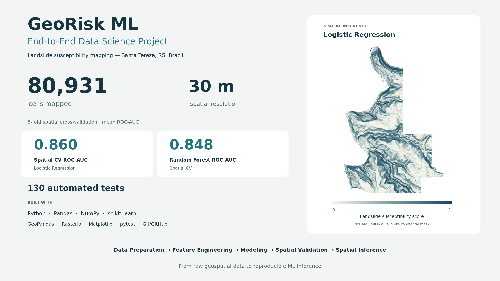
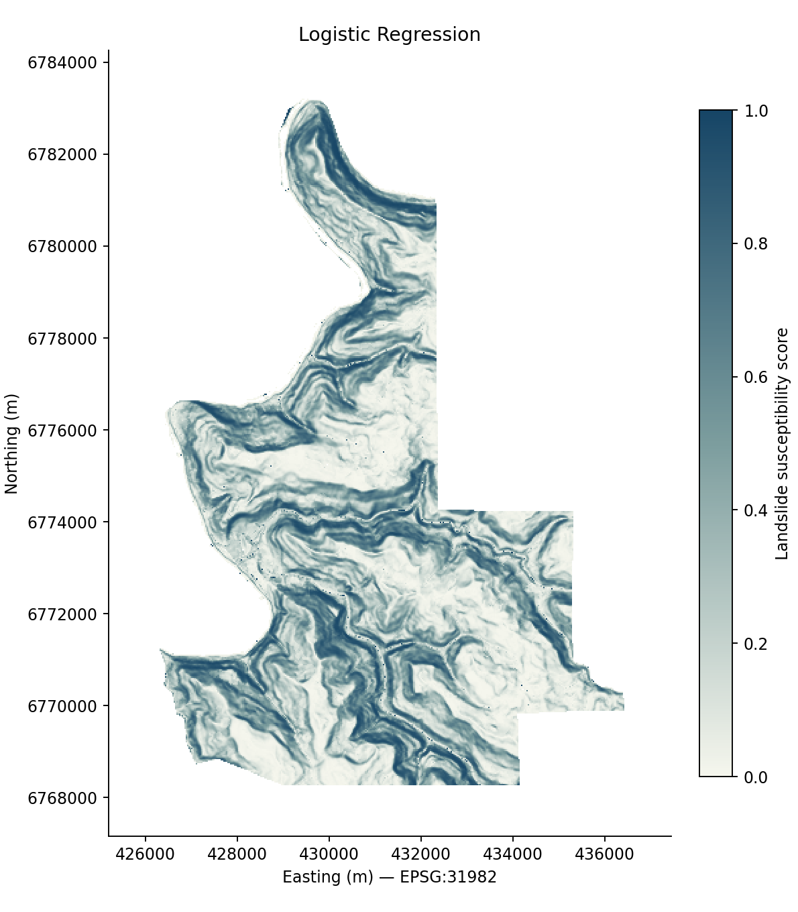
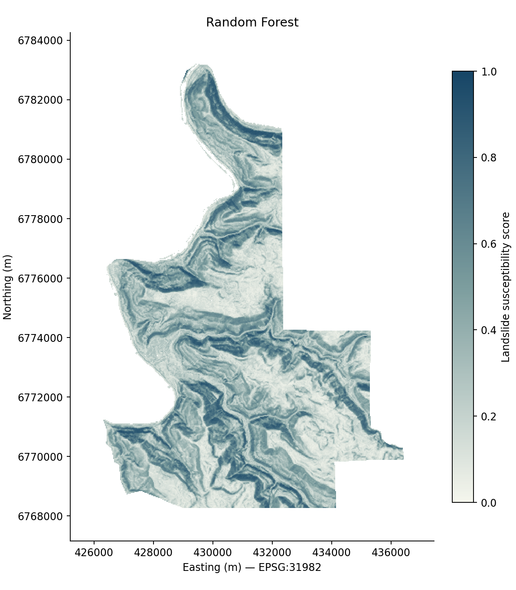
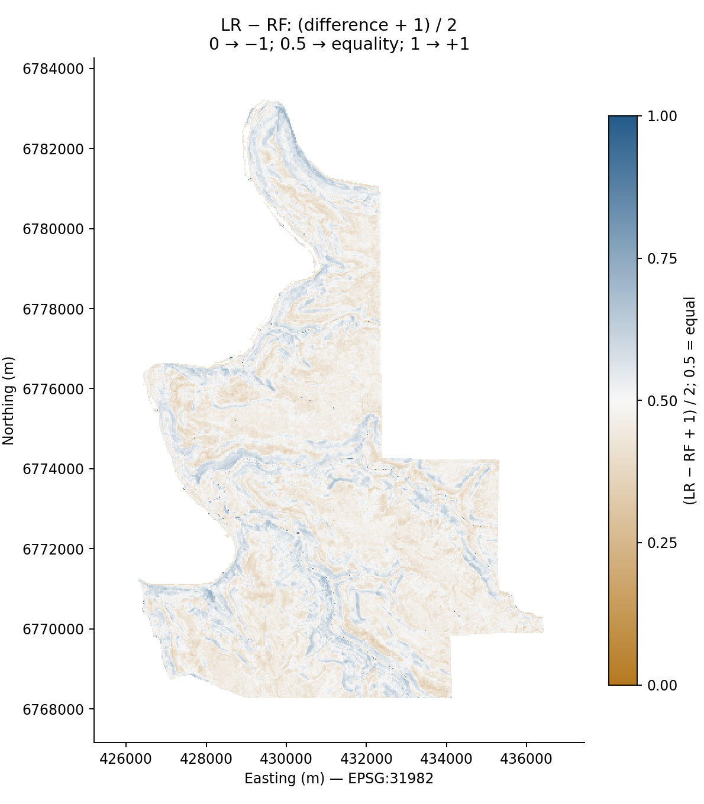
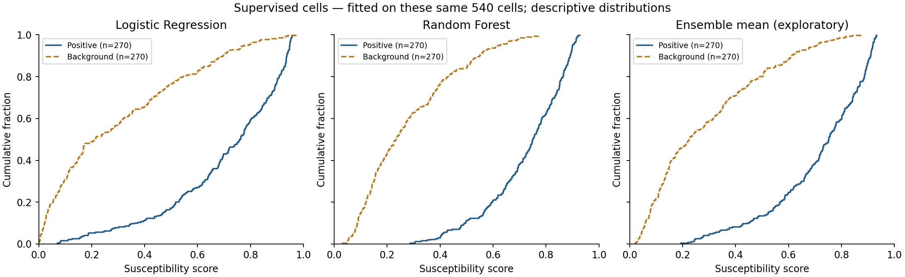

# GeoRisk ML

<p align="center">
  <strong>End-to-End Machine Learning pipeline for landslide susceptibility analysis using geospatial data, remote sensing and spatial validation.</strong>
</p>

<p align="center">
  
  
  
  
  
  
</p>

---

## Overview

**GeoRisk ML** is an applied Data Science project that combines **Machine Learning, geospatial data processing, remote sensing, spatial validation and raster inference** to support landslide susceptibility analysis.

The project was designed as an **End-to-End Machine Learning workflow**, covering the complete path from raw geospatial data to:

- data ingestion and quality control;
- environmental feature engineering;
- supervised dataset construction;
- exploratory data analysis;
- Machine Learning modeling;
- spatial cross-validation;
- sensitivity analysis;
- full-area spatial inference;
- landslide susceptibility mapping;
- automated testing and reproducibility checks.

The pilot area is **Santa Tereza, Rio Grande do Sul, Brazil**, one of the regions affected by the extreme rainfall and landslide events that occurred in the state in 2024.

The five-stage core workflow is now **completed**.

---

## Final Project Figure

<p align="center">
  
</p>

<p align="center">
  <em>
    GeoRisk ML — End-to-End Data Science workflow for landslide susceptibility mapping
    in Santa Tereza, Rio Grande do Sul, Brazil.
  </em>
</p>

### Final project snapshot

```text
80,931 valid cells mapped
30 m spatial resolution
5-fold spatial cross-validation
Logistic Regression ROC-AUC: 0.860
Random Forest ROC-AUC: 0.848
130 automated tests passing
```

---

# Project Goals

The main objective of GeoRisk ML is to develop a reproducible workflow capable of transforming heterogeneous environmental and geospatial data into Machine Learning-ready information and, ultimately, into continuous landslide susceptibility surfaces.

The project includes:

- geospatial ETL;
- integration of multiple environmental datasets;
- raster and vector processing;
- environmental feature engineering;
- supervised Machine Learning dataset construction;
- Exploratory Data Analysis;
- model training and evaluation;
- spatial cross-validation;
- leakage control;
- sensitivity analysis;
- raster inference;
- spatial QA;
- susceptibility mapping;
- automated testing and reproducibility controls.

An important methodological question investigated throughout the project is:

> **How does model performance change when the spatial dependence between training and validation data is explicitly controlled?**

---

# End-to-End Pipeline

```text
Landslide Inventory
        ↓
Geospatial ETL
        ↓
Pilot Study Area
        ↓
Environmental Feature Engineering
        ↓
Supervised ML Dataset
        ↓
Exploratory Data Analysis
        ↓
Baseline Machine Learning Models
        ↓
Spatial Cross-Validation
        ↓
Spatial Sensitivity Analysis
        ↓
Final Model Training
        ↓
Full-Area Raster Inference
        ↓
Landslide Susceptibility Mapping
```

---

# Study Area

The pilot area is:

**Santa Tereza — Rio Grande do Sul, Brazil**

The project uses a common spatial grid with:

```text
CRS: SIRGAS 2000 / UTM Zone 22S
EPSG: 31982
Spatial resolution: 30 × 30 m
Raster dimensions: 408 × 570
```

Santa Tereza was used to develop, validate and complete the End-to-End workflow.

The architecture was designed so the same workflow can later be evaluated in additional areas of Rio Grande do Sul, especially regions affected by the 2024 extreme rainfall events.

---

# Data Sources

GeoRisk ML integrates environmental, terrain and remote sensing information.

## Landslide Inventory

The starting point is the landslide inventory related to the **May 2024 extreme rainfall event in Rio Grande do Sul**.

Statewide inventory:

```text
16,862 landslide initiation points
```

After ETL and spatial quality control:

```text
16,861 valid initiation points
```

For the Santa Tereza pilot area:

```text
275 original landslide occurrences
270 unique positive raster cells
```

When multiple initiation points occurred inside the same 30 m raster cell, they were represented by one Machine Learning observation while preserving traceability.

---

## Copernicus DEM GLO-30

Terrain variables derived from the Digital Elevation Model include:

- Elevation
- Slope
- Aspect
- Plan curvature
- Profile curvature

---

## Sentinel-2

Vegetation information was represented by:

- Pre-event NDVI

The NDVI composite was generated from Sentinel-2 imagery acquired before the May 2024 event.

---

## MapBiomas

Land use and land cover information was obtained from:

- MapBiomas 2023

Original land-cover codes were preserved throughout the pipeline.

---

# Environmental Feature Engineering

All environmental layers were aligned to the same spatial grid.

```text
CRS: EPSG:31982
Resolution: 30 × 30 m
Width: 408 cells
Height: 570 cells
```

The final Machine Learning predictors are:

```text
elevation
slope
aspect_sin
aspect_cos
plan_curvature
profile_curvature
ndvi_pre_event
land_cover
```

Because aspect is a circular variable, raw aspect was transformed into:

```text
sin(aspect)
cos(aspect)
```

Spatial coordinates, row/column indices and identifiers were retained for auditing and spatial reconstruction but were **never used as predictive features**.

---

# Machine Learning Dataset

The supervised dataset uses one observation per valid 30 m raster cell.

## Landslide samples

```text
275 original occurrences
↓
270 unique positive cells
```

## Background samples

A background / pseudo-absence strategy was used.

Background samples represent reference locations and are **not interpreted as confirmed absence of landslides**.

A spatial exclusion rule was applied to avoid selecting background cells too close to mapped landslide occurrences.

Final supervised dataset:

```text
Positive cells:    270
Background cells:  270
Total samples:     540
```

The dataset was intentionally balanced during model development.

---

# Exploratory Data Analysis

The EDA stage included:

- descriptive statistics;
- class distribution;
- feature distributions;
- boxplots;
- outlier analysis;
- Pearson correlation;
- Spearman correlation;
- land-cover distribution;
- circular analysis of aspect;
- comparison between landslide and background samples.

No pair of predictors presented:

```text
|correlation| ≥ 0.80
```

Among the continuous environmental variables, **slope presented the strongest univariate separation between landslide and background samples**.

Other relevant variables included:

- elevation;
- terrain orientation;
- NDVI;
- land cover.

Outliers were identified and documented but were **not automatically removed**.

---

# Machine Learning Models

Two classification algorithms were implemented throughout the project:

## Logistic Regression

Pipeline:

```text
Continuous variables
        ↓
StandardScaler
        ↓
Logistic Regression

Land cover
        ↓
OneHotEncoder
```

## Random Forest

Pipeline:

```text
Continuous variables
        ↓
Passthrough

Land cover
        ↓
OneHotEncoder
        ↓
Random Forest
```

For categorical land-cover values:

```python
OneHotEncoder(handle_unknown="ignore")
```

was used so inference can safely handle categories absent from the supervised training sample.

No hyperparameter tuning was performed during the project.

---

# Preliminary Random Holdout

The first model evaluation used a conventional stratified split:

```text
Training: 75%
Testing:  25%
Random state: 42
```

Results:

| Model | Accuracy | Recall | F1 | ROC-AUC |
|---|---:|---:|---:|---:|
| Logistic Regression | 0.807 | 0.881 | 0.819 | **0.887** |
| Random Forest | 0.837 | 0.851 | 0.838 | **0.896** |

These results were treated exclusively as **preliminary baselines**.

Random splitting can overestimate performance in spatial datasets because geographically close observations may share similar environmental characteristics.

For this reason, model evaluation was extended to spatial cross-validation.

---

# Spatial Cross-Validation

Spatial validation was implemented with:

```python
StratifiedGroupKFold
```

The study area was divided into square spatial blocks.

Configuration:

```text
Block size:        1,500 × 1,500 m
Cells per block:   50 × 50
Occupied blocks:   42
Number of folds:   5
Random state:      42
```

Samples belonging to the same spatial block always remain in the same fold.

This prevents the same spatial block from appearing simultaneously in training and validation.

All preprocessing components are also fitted exclusively on the training portion of each fold.

---

# Spatial Validation Results

Mean results across the five spatial folds:

| Model | Accuracy | Recall | F1 | ROC-AUC |
|---|---:|---:|---:|---:|
| Logistic Regression | **0.776** | **0.798** | **0.768** | **0.860** |
| Random Forest | 0.755 | 0.745 | 0.741 | 0.848 |

Compared with the random holdout:

| Model | Random Holdout ROC-AUC | Spatial CV ROC-AUC |
|---|---:|---:|
| Logistic Regression | 0.887 | **0.860** |
| Random Forest | 0.896 | **0.848** |

The reduction in performance illustrates the importance of controlling spatial dependence during evaluation.

The spatial validation represents a more demanding estimate of model generalization than the preliminary random holdout.

---

# Spatial Sensitivity Analysis

To evaluate the stability of the spatial validation results, an additional analysis introduced a:

```text
300 m training-validation buffer
```

The validation folds remained unchanged.

Training samples located less than 300 m from validation samples were removed before model fitting.

The buffer was predefined and was **not optimized according to model performance**.

---

## Results with the 300 m Buffer

| Model | Metric | Spatial CV | 300 m Buffer | Difference |
|---|---|---:|---:|---:|
| Logistic Regression | ROC-AUC | 0.8600 | 0.8572 | -0.0028 |
| Logistic Regression | F1 | 0.7676 | 0.7618 | -0.0058 |
| Random Forest | ROC-AUC | 0.8476 | 0.8459 | -0.0017 |
| Random Forest | F1 | 0.7414 | 0.7267 | -0.0147 |

Average ROC-AUC changed only slightly after introducing the stricter spatial separation.

This suggests that the main qualitative conclusions were relatively stable under the sensitivity analysis.

Some individual folds, however, showed greater variation in metrics such as recall and F1.

---

# Final Model Training

After completing spatial validation, both models were retrained using the entire supervised dataset:

```text
270 landslide cells
+
270 background cells
=
540 training samples
```

The same features, preprocessing rules and model parameters validated in the previous stages were preserved.

Final models:

- Logistic Regression
- Random Forest

No additional tuning was performed.

---

# Full-Area Spatial Inference

The trained models were applied to every environmentally valid raster cell inside the pilot area.

Municipal cells:

```text
81,774
```

Cells satisfying the complete environmental-data mask:

```text
80,931
```

Therefore:

> **80,931 spatial cells received susceptibility scores from both final models.**

The inference pipeline preserves:

```text
row
col
x
y
```

only for spatial reconstruction.

These attributes are not used as model predictors.

---

# Landslide Susceptibility Products

Three continuous susceptibility surfaces were generated:

```text
santa_tereza_susceptibility_logistic.tif

santa_tereza_susceptibility_random_forest.tif

santa_tereza_susceptibility_ensemble_mean.tif
```

The ensemble is the simple arithmetic mean between Logistic Regression and Random Forest outputs.

It is included as an **exploratory product** and was not independently validated as a third model.

---

## Logistic Regression Surface

<p align="center">
  
</p>

<p align="center">
  <em>Logistic Regression susceptibility surface.</em>
</p>

---

## Random Forest Surface

<p align="center">
  
</p>

<p align="center">
  <em>Random Forest susceptibility surface.</em>
</p>

---

## Spatial Difference Between Models

<p align="center">
  
</p>

<p align="center">
  <em>
    Spatial comparison between Logistic Regression and Random Forest outputs.
    Values close to the center of the scale indicate greater agreement.
  </em>
</p>

---

# Raster Specifications

All final GeoTIFFs use:

```text
CRS: EPSG:31982
Resolution: 30 × 30 m
Dimensions: 408 × 570
Data type: float32
NoData: -9999
Compression: DEFLATE
```

Every valid environmental cell received a score.

Cells outside the valid-data mask remain NoData.

No output score was found outside:

```text
[0, 1]
```

---

# Susceptibility Score Distribution

Scores for all **80,931 valid cells**:

| Statistic | Logistic Regression | Random Forest | Exploratory Ensemble |
|---|---:|---:|---:|
| Minimum | 1.62e-10 | 0.0212 | 0.0114 |
| P5 | 0.0122 | 0.0849 | 0.0535 |
| P25 | 0.0846 | 0.1800 | 0.1365 |
| Median | 0.2635 | 0.3247 | 0.2955 |
| Mean | 0.3315 | 0.3611 | 0.3463 |
| P75 | 0.5447 | 0.5127 | 0.5269 |
| P95 | 0.8450 | 0.7609 | 0.7912 |
| Maximum | ~1.0000 | 0.9314 | 0.9407 |

The Logistic Regression surface shows a wider score range, while Random Forest predictions are more concentrated.

---

# Supervised Sample Score Distributions

<p align="center">
  
</p>

The final trained models were also evaluated descriptively over the supervised samples.

| Model | Positive Mean | Positive Median | Background Mean | Background Median |
|---|---:|---:|---:|---:|
| Logistic Regression | 0.702 | 0.761 | 0.298 | 0.212 |
| Random Forest | 0.723 | 0.751 | 0.278 | 0.233 |
| Exploratory Ensemble | 0.713 | 0.753 | 0.288 | 0.225 |

These values refer to the **same observations used for final model fitting**.

Therefore, they are descriptive and should **not be interpreted as an independent evaluation of model generalization**.

Generalization performance is represented by the spatial validation results from Stage 4.

---

# Comparison Between Susceptibility Surfaces

Logistic Regression and Random Forest generated strongly related but non-identical spatial surfaces.

Across the 80,931 valid cells:

```text
Pearson correlation:          0.9185
Mean absolute difference:     0.0979
RMSE between surfaces:        0.1189
Mean LR − RF:                -0.0296
```

The high correlation indicates strong agreement in the broad spatial pattern.

However, local differences remain relevant, demonstrating that the two algorithms do not produce identical susceptibility representations.

These statistics describe **agreement between spatial surfaces** and are not model-validation metrics.

---

# Model Interpretation

The project deliberately avoids declaring a universal "best model".

During spatial validation:

### Logistic Regression showed higher mean:

- Accuracy
- Balanced Accuracy
- Recall
- F1
- ROC-AUC

### Random Forest showed slightly higher mean:

- PR-AUC
- Average Precision

Both algorithms were therefore retained for final spatial inference.

This also allows comparison between a relatively interpretable linear classifier and a nonlinear ensemble model.

---

# Important Methodological Note

The supervised dataset uses a balanced:

```text
270 landslide
270 background
```

sampling strategy.

This 1:1 distribution does **not represent the territorial prevalence of landslides**.

Therefore:

> model outputs must not automatically be interpreted as calibrated real-world probabilities of landslide occurrence.

The final raster values are described as:

**landslide susceptibility scores**

rather than calibrated occurrence probabilities.

The background class should also be understood as **pseudo-absence / reference locations**, not confirmed landslide absence.

---

# Land-Cover Generalization

During full-area inference, **91 cells** contained MapBiomas land-cover codes:

```text
12
25
39
```

that were absent from the supervised training dataset.

The validated:

```python
OneHotEncoder(handle_unknown="ignore")
```

safely handled these unseen categories.

No categories were replaced, grouped or removed.

However, the models cannot learn a category-specific contribution for classes that were absent during training.

This is documented as a limitation of the final spatial inference.

---

# Data Science Stack

GeoRisk ML combines conventional Data Science tools with geospatial analytics.

## Data Analysis and Machine Learning

```text
Python
Pandas
NumPy
SciPy
scikit-learn
Matplotlib
```

Techniques used include:

- Data cleaning
- Exploratory Data Analysis
- Feature engineering
- Supervised classification
- Feature scaling
- Categorical encoding
- Logistic Regression
- Random Forest
- ROC-AUC analysis
- Precision-Recall analysis
- Confusion matrices
- Grouped cross-validation
- Spatial validation
- Sensitivity analysis
- Batch inference
- Model reproducibility

---

## Geospatial Processing

```text
GeoPandas
Rasterio
Shapely
QGIS
ArcGIS Pro
```

Applications include:

- vector processing;
- raster processing;
- coordinate reference systems;
- spatial masks;
- raster alignment;
- terrain analysis;
- environmental feature extraction;
- spatial sampling;
- spatial blocks;
- raster reconstruction;
- GeoTIFF generation.

---

## Remote Sensing

```text
Sentinel-2
Copernicus DEM GLO-30
MapBiomas
NDVI
Terrain derivatives
```

---

## Software Engineering and Reproducibility

```text
Git
GitHub
pytest
Python virtual environments
AWS S3
```

The codebase follows a modular architecture separating:

```text
Extraction
Transformation
Feature Engineering
Modeling
Validation
Inference
Testing
Documentation
```

---

# Automated Testing

Testing is integrated throughout the entire pipeline.

The current test suite contains:

```text
130 passing tests
0 failures
```

Tests cover:

- dataset integrity;
- raster alignment;
- environmental feature generation;
- pseudo-absence sampling;
- sampling reproducibility;
- feature contracts;
- preprocessing;
- model parameters;
- prediction probabilities;
- data leakage;
- spatial grouping;
- spatial buffering;
- unknown categorical values;
- inference-grid integrity;
- raster-mask consistency;
- CRS validation;
- raster transform validation;
- NoData behavior;
- output score validation;
- deterministic model reproduction;
- protection of previous-stage artifacts.

The final Stage 5 execution also verified that **125 previously existing files remained unchanged**.

---

# Repository Structure

```text
georisk-ml/
│
├── data/
│   ├── raw/
│   ├── interim/
│   └── processed/
│
├── docs/
│   ├── images/
│   │   ├── georisk_ml_final_figure.png
│   │   ├── map_logistic.png
│   │   ├── map_random_forest.png
│   │   ├── map_difference_lr_minus_rf.png
│   │   └── positive_background_distributions.png
│   │
│   ├── final_figure.md
│   ├── dataset_stage3.md
│   ├── ml_eda_stage3.md
│   ├── baseline_models_stage3.md
│   ├── spatial_validation_stage4.md
│   ├── spatial_validation_buffer300.md
│   └── susceptibility_mapping_stage5.md
│
├── outputs/
│   ├── eda/
│   ├── figures/
│   │   └── georisk_ml_final_figure.png
│   └── models/
│       ├── baseline/
│       ├── spatial_validation/
│       ├── spatial_validation_buffer300/
│       └── final/
│
├── scripts/
│   └── make_final_figure.py
│
├── src/
│   ├── extract/
│   ├── transform/
│   ├── features/
│   └── models/
│       ├── train_baselines.py
│       ├── evaluate_baselines.py
│       ├── spatial_validation.py
│       ├── evaluate_spatial_validation.py
│       ├── build_inference_grid.py
│       ├── train_final_models.py
│       ├── generate_susceptibility.py
│       └── evaluate_susceptibility.py
│
├── tests/
│
├── requirements.txt
└── README.md
```

Large datasets and generated outputs may be excluded from Git according to the repository storage strategy.

---

# Project Stages

## Stage 1 — Geospatial ETL ✅

- [x] Landslide inventory ingestion
- [x] Spatial quality control
- [x] Duplicate handling
- [x] CRS standardization
- [x] Pilot study area extraction

---

## Stage 2 — Environmental Feature Engineering ✅

- [x] Copernicus DEM
- [x] Elevation
- [x] Slope
- [x] Aspect
- [x] Plan curvature
- [x] Profile curvature
- [x] MapBiomas 2023
- [x] Sentinel-2 pre-event NDVI
- [x] Common raster grid
- [x] Joint environmental mask

---

## Stage 3 — Machine Learning Dataset and Baselines ✅

- [x] Positive-cell aggregation
- [x] Background / pseudo-absence sampling
- [x] Supervised ML dataset
- [x] Exploratory Data Analysis
- [x] Logistic Regression
- [x] Random Forest
- [x] Preliminary random holdout

---

## Stage 4 — Spatial Validation ✅

- [x] Spatial block generation
- [x] Stratified grouped cross-validation
- [x] Fold-level model evaluation
- [x] Comparison with random holdout
- [x] 300 m buffer sensitivity analysis
- [x] Spatial leakage tests

---

## Stage 5 — Susceptibility Mapping ✅

- [x] Final model training
- [x] Full-area inference grid
- [x] Prediction for 80,931 valid cells
- [x] Logistic Regression susceptibility raster
- [x] Random Forest susceptibility raster
- [x] Exploratory ensemble raster
- [x] Raster QA
- [x] Model-surface comparison
- [x] Reproducibility validation
- [x] Final documentation
- [x] Final presentation figure

---

# Final Project Status

```text
Stage 1 — ETL                         ✅
Stage 2 — Feature Engineering         ✅
Stage 3 — ML Dataset & Baselines      ✅
Stage 4 — Spatial Validation          ✅
Stage 5 — Susceptibility Mapping      ✅
```

> **Core End-to-End GeoRisk ML pipeline completed.**

---

# Future Extensions

The core pipeline is complete, but several extensions remain possible:

- apply the workflow to other municipalities in Rio Grande do Sul;
- evaluate transferability between geographic regions;
- investigate different spatial validation scales;
- incorporate additional environmental predictors;
- evaluate additional Machine Learning algorithms;
- analyze temporal vegetation information;
- investigate probability calibration;
- develop an interactive susceptibility dashboard;
- deploy automated geospatial inference workflows.

A particularly relevant next experiment is testing the workflow in other areas affected by the **2024 extreme rainfall events in Rio Grande do Sul**.

---

# Why This Project?

GeoRisk ML was designed as more than a GIS project.

It demonstrates a complete applied Data Science workflow:

```text
Data Engineering
        +
Data Quality
        +
Exploratory Data Analysis
        +
Feature Engineering
        +
Machine Learning
        +
Model Validation
        +
Spatial Cross-Validation
        +
Batch Inference
        +
Software Testing
        +
Geospatial Analytics
        +
Remote Sensing
```

The geospatial domain provides the application context, while the project architecture focuses on broader concepts used in real-world Data Science projects:

- reproducible pipelines;
- heterogeneous data integration;
- feature engineering;
- leakage prevention;
- model evaluation;
- generalization;
- automated testing;
- inference pipelines;
- traceability;
- reproducibility.

---

# Author

**Thiago Wallace**

Cartographic and Surveying Engineer | Data Scientist | Geospatial Data Science

- LinkedIn: [linkedin.com/in/thiagowallace](https://www.linkedin.com/in/thiagowallace)
- GitHub: [github.com/thiagowallace](https://github.com/thiagowallace)

---

## Status

> ✅ **End-to-End pipeline completed**  
> 🧪 **130 automated tests passing**  
> 🗺️ **80,931 cells mapped**  
> 🤖 **Logistic Regression + Random Forest**  
> 📍 **Santa Tereza — Rio Grande do Sul, Brazil**
